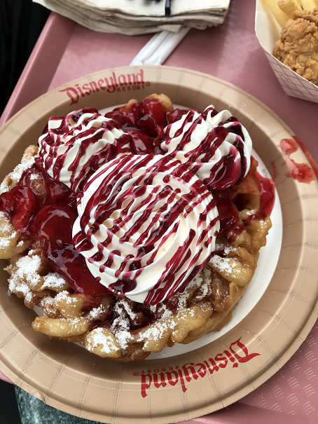
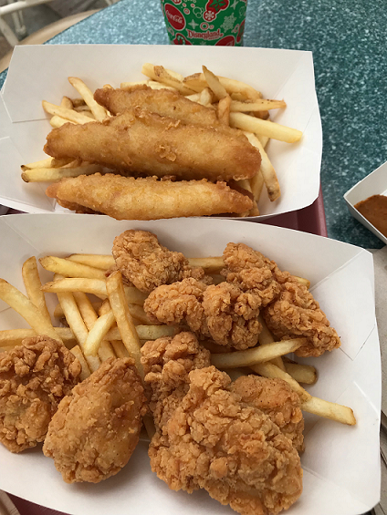
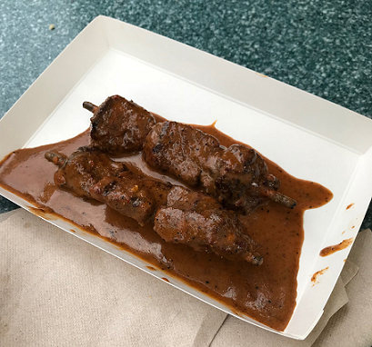

I've been to Disneyland many times, but this time around I would like to show the great food I got to try.

1. Disneyland Funnel Cake at Stage Door Cafe

If I could get this everyday, I totally would! The crisp of the funnel cake and the whipped cream just satisfies my soul. In addition, the drizzle of the sauce is amazing!!

2. Fish Sticks, Chicken Tenders, and Fries at The Golden Horseshoe

The Golden Horseshoe is a great place to chill. I tried the fish and chips along with the chicken tenders that came with fries and it was DELICIOUS! The best part was the tartar sauce. Definetly a great lunch.

3. Bengal Beef Skewers at Bengal Barbecue

The beef skewers at Bengal Barbecue is great! It is on the pricey side, but these skewers are really worth trying!
